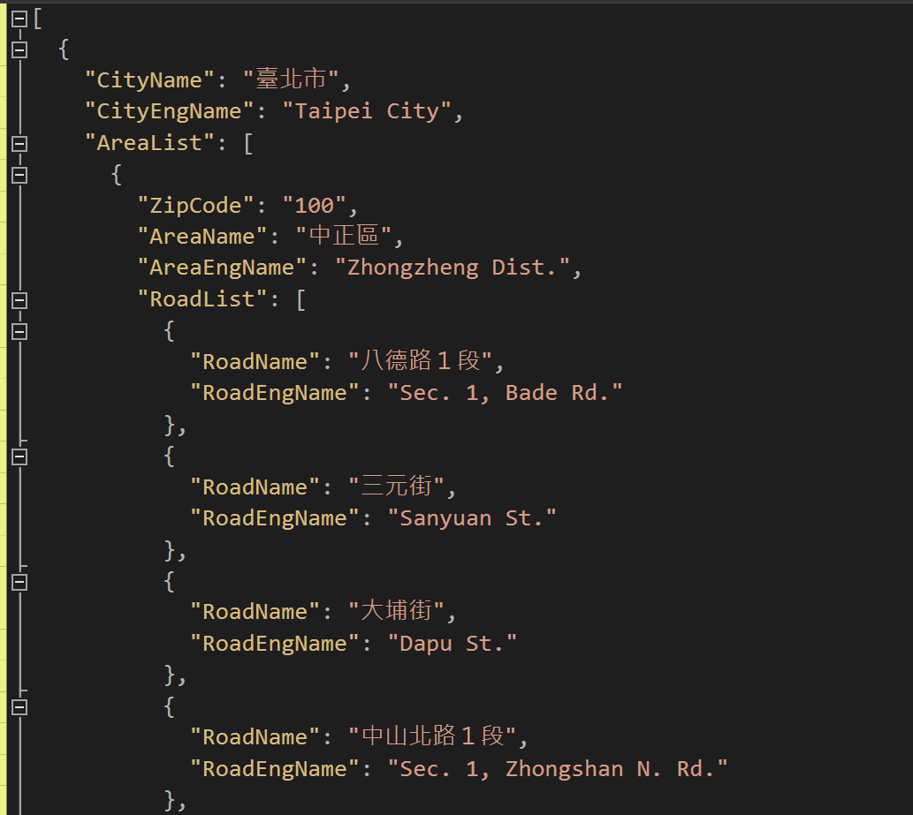

# Taiwan Address City Area Road Chinese English JSON

台灣縣市、行政區、郵遞區號與路名的中英文對照 JSON 資料集。

這個專案整理了台灣地址常用的結構化資料，主要包含：

- 縣市中文與英文名稱
- 鄉鎮市區中文與英文名稱
- 郵遞區號
- 路名中英文對照資料

目前 repository 內主要提供以下檔案：

- `CityCountyData.json`
- `AllData.json`

這份資料的重點，不只是整理台灣地址結構，而是把中英文對照一起補齊，方便直接用在實際專案中。

---

## Why This Project

在實際開發中，台灣地址資料常常會遇到幾個麻煩：

- 前端表單需要縣市 / 區域下拉選單
- 後端需要穩定的郵遞區號與行政區資料
- 英文地址欄位需要可對照的英文名稱
- 匯出、物流、會員系統需要比較一致的地址格式
- 少見字路名與英文翻譯很容易出錯

這個專案的目的，就是把這些常用地址資料整理成可直接使用的 JSON，減少每次都要自己重新清洗資料的成本。

---

## Files

### `CityCountyData.json`

提供台灣縣市與行政區資料，適合用於：

- 縣市 / 區域下拉選單
- 郵遞區號查詢
- 表單初始化
- 基本地址驗證

### `AllData.json`

提供更完整的地址資料，除了縣市與行政區，也包含路名中英文對照，適合用於：

- 中文地址轉英文地址
- 地址自動補全
- 訂單 / 會員 / 物流系統地址標準化
- 匯出國際格式地址資料

---

## Use Cases

這份資料集適合使用在：

- Web 表單地址選單
- 電商 / ERP / CRM 系統
- 中文地址轉英文地址
- 郵遞區號對照查詢
- 地址標準化工具
- 匯入前資料清洗
- autocomplete / search 功能

---

## Example

以下是概念性示意：

~~~json
{
  "city": "台北市",
  "cityEnglish": "Taipei City",
  "area": "大安區",
  "areaEnglish": "Da'an Dist.",
  "zipCode": "106",
  "road": "忠孝東路四段",
  "roadEnglish": "Sec. 4, Zhongxiao E. Rd."
}
~~~

實際欄位名稱與資料格式，請以 repository 內 JSON 檔案內容為準。

---

## Notes

- 本資料集重點之一是補上中英文對照
- 已額外校正大量罕見字路名與英文翻譯
- 若在實務使用中發現翻譯、拼字或行政區資料有誤，歡迎提出 issue 或 PR 一起修正

---

## Data Source

資料整理參考：

- 中華郵政地址資料下載頁面  
  http://www.post.gov.tw/post/internet/Download/all_list.jsp?ID=2201#dl_txt_s_A0206

---

## Credits

感謝以下協助者：

- [Eleven Hsiao](https://github.com/nicky17558)
- Pansy Pan

感謝協助資料提供與校對。

---

## License

本專案採用 MIT 授權。

版權所有 (c) 2016 Donma

茲授權任何取得本軟體及相關文件副本之人，得不受限制地使用本軟體，包括但不限於使用、複製、修改、合併、出版、散布、再授權及販售本軟體之副本，並允許接受本軟體之人為上述行為，但須符合下列條件：

上述版權聲明及本授權聲明，應包含於本軟體之所有副本或重要部分中。

本軟體係依現況提供，不附任何明示或默示之保證，包括但不限於適售性、特定用途適用性及不侵權之保證。在任何情況下，無論係因契約行為、侵權行為或其他原因所生之任何請求、損害或其他責任，著作權人或版權所有人均不負任何責任，即使該等責任係因本軟體或本軟體之使用或其他交易而起。

---

## 免責聲明

本專案所提供之資料，主要作為開發、測試、研究與一般參考用途。

雖然內容已盡量整理、校正與補充，但仍不保證所有資料在任何時間點都完全正確、完整、最新，亦不保證一定適用於特定商業、法律、郵務、地理或正式行政用途。

使用者在正式環境、商業系統或重要流程中使用本資料前，應自行再次驗證內容正確性與適用性。

因使用本專案、其資料內容、或依據本資料進行處理所造成之任何直接或間接損失、錯誤、資料問題、業務影響或其他責任，專案作者與貢獻者均不負擔任何責任。
